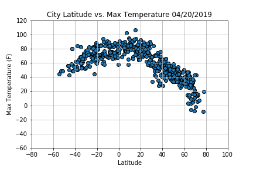
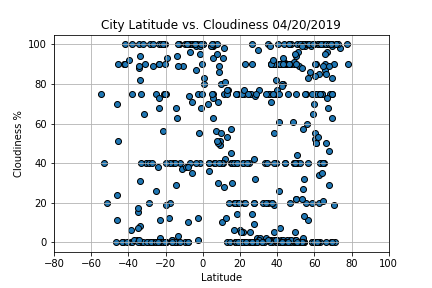

# Weather Py Web Visualization Dashboard

This is an analysis of over 500 cities around the world utililising Python, APIs, JSON and HTML-CSS to create an interactive dashboard to visualize it.

[Link to the Github.io web dashboard](https://mrinmayeekulkarni.github.io/Weather-Py/index.html)

## WeatherPy

This Python project was to create a visualization for the 500+ cities at varying distances from the equator to analyze the weather as one gets closer towards the equator. For this project the resources used were,
[simple Python library](https://pypi.python.org/pypi/citipy), 
[OpenWeatherMap API](https://openweathermap.org/api)

The objective was to build this analysis through scatter plots,

### Temperature (F) vs. Latitude

### Cloudiness (%) vs. Latitude

The purpose for this proect was achieved as we can get to know through the HTML dashboard that the weather for all of these cities changes as their location is nearer towards the equator.
